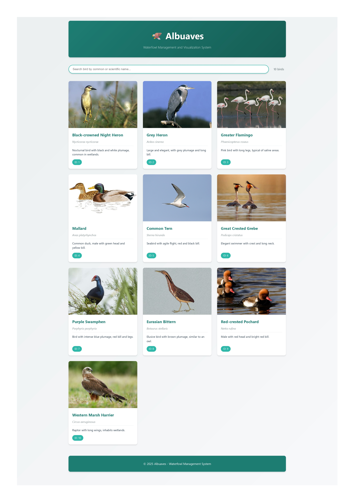
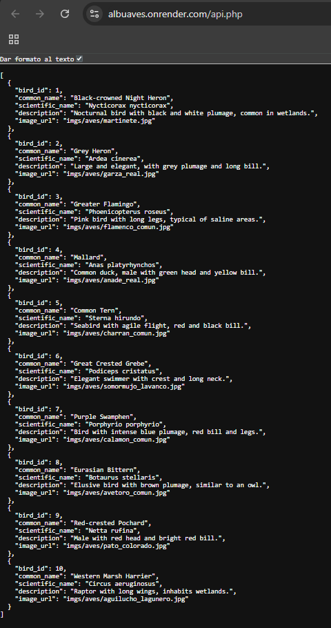
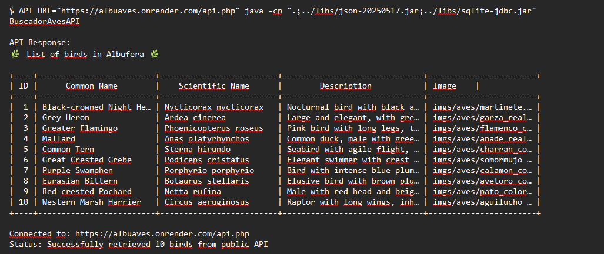

# 🦅 Albuaves - Albufera Bird Management System

Complete dockerized system for managing and querying waterfowl from the Albufera of Valencia. Includes:
- 🌐 **Visual web interface** with bird gallery and images
- 📱 **REST API** in PHP with SQLite
- 💻 **Java client** to consume the API
- 🗄️ **Database** with 10 species of waterfowl

---

## 🌐 Public Server (Production)

**✅ Application deployed and accessible from the Internet!**

**Live URLs:**

- 🌐 **Web Interface:** https://albuaves.onrender.com/
- 📡 **REST API:** https://albuaves.onrender.com/api.php
- 🏢 **Platform:** Render (Free Tier)
- 🗄️ **Database:** Embedded SQLite
- 🌍 **Status:** Live and running

**Note:** First load may take ~30 seconds if the service was idle (Render free tier limitation).

---

## 🖥️ School Server (Local Network)

**✅ Application deployed on school server!**

**Local Network Access:**

- 🌐 **Web Interface:** http://192.168.3.113:8000/
- 📡 **REST API:** http://192.168.3.113:8000/api.php
- 🏢 **Server:** PHP 8.3 Built-in Server
- 🗄️ **Database:** Embedded SQLite
- 🌍 **Status:** Live and running on port 8000

### SSH Access

**Server Details:**
- **Host:** 192.168.3.113
- **User:** pau
- **Project Directory:** /home/pau/albuaves/

### Server Management

**Start the server:**
```bash
ssh pau@192.168.3.113 './start_albuaves.sh'
```

**Stop the server:**
```bash
ssh pau@192.168.3.113 './stop_albuaves.sh'
```

**View logs:**
```bash
ssh pau@192.168.3.113 'tail -f ~/albuaves/server.log'
```

**Check server status:**
```bash
ssh pau@192.168.3.113 'ps aux | grep "php -S"'
```

**Note:** The server runs on port 8000 instead of port 80 due to user permissions. The application is fully functional and accessible within the local network.

---

## Requirements

- Docker Desktop installed
- Docker Compose installed

**That's all.** You don't need to install PHP, Java, or any other dependencies on your system.

## Quick Start

Choose one of these options (all do the same thing automatically):

### Windows
```bash
run-docker.bat
```

### Linux/Mac/WSL
```bash
chmod +x start.sh
./start.sh
```

**Note:** The above scripts internally run `docker-compose up --build`, so you can also use directly:
```bash
docker-compose up --build
```

## Quick Access

Once the system is started, you have two ways to access it:

### 🌐 Option 1: Visual Web Interface (Recommended)

**URL:** http://localhost:9191/

This is the easiest and most visual way to explore the birds. You will see:
- 📷 **10 cards with images** of each waterfowl
- 🔍 **Real-time search** to filter birds by name
- ℹ️ **Complete information** for each bird (common name, scientific name, description)
- 📱 **Responsive design** that works on mobile, tablet and desktop

### 📡 Option 2: REST API (For developers)

**URL:** http://localhost:9191/api.php

#### Available endpoints

---

## 🖼️ Web Interface - Preview

### Screenshot of the interface

**Live Web Interface (English):**

<p align="center">
  
</p>

### 📡 API Response - Example

Access the API directly in your browser: `http://localhost:9191/api.php` or via public URL: `https://albuaves.onrender.com/api.php`

**Screenshot - API in Browser:**

<p align="center">
  
</p>

**Example JSON Response:**
```json
[
  {
    "bird_id": 1,
    "common_name": "Black-crowned Night Heron",
    "scientific_name": "Nycticorax nycticorax",
    "description": "Nocturnal bird with black and white plumage, common in wetlands.",
    "image_url": "imgs/aves/martinete.jpg"
  },
  {
    "bird_id": 2,
    "common_name": "Grey Heron",
    "scientific_name": "Ardea cinerea",
    "description": "Large and elegant, with grey plumage and long bill.",
    "image_url": "imgs/aves/garza_real.jpg"
  }
  // ... (8 more birds)
]
```

**Full response available at:** [`docimgs/api-response-example.json`](docimgs/api-response-example.json)

### 💻 Java Client - Terminal Output

The Java client consumes the API and displays results in a formatted table:

**Screenshot - Java Client Running:**

<p align="center">
  
</p>

**Example Output:**

```
API Response:
🌿 List of birds in Albufera 🌿

+----+-------------------------+-------------------------+------------------------------+-----------------------+
| ID |      Common Name        |    Scientific Name      |        Description           | Image    |
+----+-------------------------+-------------------------+------------------------------+-----------------------+
|  1 | Black-crowned Night H…  | Nycticorax nycticorax   | Nocturnal bird with black…   | imgs/aves/martinete.j…|
|  2 | Grey Heron              | Ardea cinerea           | Large and elegant, with g…   | imgs/aves/garza_real.…|
|  3 | Greater Flamingo        | Phoenicopterus roseus   | Pink bird with long legs,…   | imgs/aves/flamenco_co…|
|  4 | Mallard                 | Anas platyrhynchos      | Common duck, male with gr…   | imgs/aves/anade_real.…|
|  5 | Common Tern             | Sterna hirundo          | Seabird with agile flight…   | imgs/aves/charran_com…|
|  6 | Great Crested Grebe     | Podiceps cristatus      | Elegant swimmer with cres…   | imgs/aves/somormujo_l…|
|  7 | Purple Swamphen         | Porphyrio porphyrio     | Bird with intense blue pl…   | imgs/aves/calamon_com…|
|  8 | Eurasian Bittern        | Botaurus stellaris      | Elusive bird with brown p…   | imgs/aves/avetoro_com…|
|  9 | Red-crested Pochard     | Netta rufina            | Male with red head and br…   | imgs/aves/pato_colora…|
| 10 | Western Marsh Harrier   | Circus aeruginosus      | Raptor with long wings, i…   | imgs/aves/aguilucho_l…|
+----+-------------------------+-------------------------+------------------------------+-----------------------+
```

**Full output available at:** [`docimgs/java-client-output.txt`](docimgs/java-client-output.txt)

---

### What you will see in the interface

- **Header:** Title "🦅 Albuaves" with description
- **Search:** Real-time search box at the top
- **Gallery:** Grid of cards (2-4 columns depending on screen) with:
  - 📷 Image of each bird (high-quality real photos)
  - 🏷️ Common name
  - 🔬 Scientific name
  - 📝 Detailed description
- **Responsive:** Automatically adapts to mobile, tablet and desktop
- **Interactive:** Cards elevate on hover, with smooth visual effects

---

```bash
# Get all birds in JSON
curl http://localhost:9191/api.php

# Get a specific bird by ID
curl http://localhost:9191/api.php?id=1

# Or simply open in your browser:
http://localhost:9191/api.php
```

#### Example response
```json
[
  {
    "id_ave": 1,
    "nombre_comun": "Martinete",
    "nombre_cientifico": "Nycticorax nycticorax",
    "descripcion": "Ave nocturna de plumaje blanco y negro, común en humedales.",
    "imagen_url": "imgs/aves/martinete.jpg"
  },
  ...
]
```

## Project Structure

```
UP02-Proyecto-DAM-Albuaves/
├── docker-compose.yml                    # Docker services orchestration
├── README.md                             # This file (documentation)
├── start.sh                              # Linux/Mac/WSL startup script
├── run-docker.sh                        # Detailed Linux/Mac startup script
├── run-docker.bat                       # Windows startup script
├── test-api.sh                          # Script to test the API
│
├── php/                                  # 🌐 WEB INTERFACE
│   ├── Dockerfile                       # Docker image PHP 8.2 + Apache
│   ├── api.php                          # REST API in PHP
│   ├── index.html                       # Main page (visual interface)
│   ├── style.css                        # Interface CSS styles
│   ├── script.js                        # JavaScript - interface logic
│   ├── .htaccess                        # Apache configuration (URL rewriting)
│   ├── router.php                       # Auxiliary router
│   └── imgs/aves/                       # 📷 BIRD IMAGES (10 photos)
│       ├── martinete.jpg
│       ├── garza_real.jpg
│       ├── flamenco_comun.jpg
│       ├── anade_real.jpg
│       ├── charran_comun.jpg
│       ├── somormujo_lavanco.jpg
│       ├── calamon_comun.jpg
│       ├── avetoro_comun.jpg
│       ├── pato_colorado.jpg
│       └── aguilucho_lagunero.jpg
│
├── java/                                 # 💻 JAVA CLIENT
│   ├── Dockerfile                       # Docker image Java 17
│   └── BuscadorAvesAPI.java             # Client that consumes the API
│
├── db/                                   # 🗄️ DATABASE
│   ├── albuaves.db                      # SQLite with 10 species
│   ├── albuaves-db-create.sql          # Table creation script
│   └── albuaves-tables-population.sql  # Data insertion script
│
└── libs/                                 # 📚 LIBRARIES
    ├── json-20250517.jar               # JSON parser for Java
    └── sqlite-jdbc.jar                 # SQLite JDBC driver
```

## 🛠️ Technologies Used

This project integrates multiple modern technologies to offer a complete and professional solution:

### Backend and API

| Technology | Version | Description | Official Link |
|-----------|---------|-------------|----------------|
| **PHP** | 8.2 | Server language for REST API | [php.net](https://www.php.net/) |
| **Apache** | 2.4 | HTTP web server | [httpd.apache.org](https://httpd.apache.org/) |
| **SQLite** | 3.x | Embedded relational database | [sqlite.org](https://www.sqlite.org/) |

### Java Client

| Technology | Version | Description | Official Link |
|-----------|---------|-------------|----------------|
| **Java** | OpenJDK 17 | Development platform | [openjdk.org](https://openjdk.org/) |
| **JSON-java** | 20250517 | JSON processing library | [github.com/stleary/JSON-java](https://github.com/stleary/JSON-java) |
| **SQLite JDBC** | Latest | JDBC driver for SQLite | [github.com/xerial/sqlite-jdbc](https://github.com/xerial/sqlite-jdbc) |

### Frontend

| Technology | Description | Documentation |
|-----------|-------------|---------------|
| **HTML5** | Modern semantic structure | [MDN Web Docs](https://developer.mozilla.org/en-US/docs/Web/HTML) |
| **CSS3** | Styles with gradients and responsive design | [MDN Web Docs](https://developer.mozilla.org/en-US/docs/Web/CSS) |
| **JavaScript (ES6+)** | Interface logic (Fetch API, DOM) | [MDN Web Docs](https://developer.mozilla.org/en-US/docs/Web/JavaScript) |

### Infrastructure

| Technology | Version | Description | Official Link |
|-----------|---------|-------------|----------------|
| **Docker** | 20.10+ | Containerization platform | [docker.com](https://www.docker.com/) |
| **Docker Compose** | 2.x | Multi-container service orchestration | [docs.docker.com/compose](https://docs.docker.com/compose/) |

---

## 📜 Licenses

All technologies used in this project are open source or free:

| Component | License | Type | Details |
|-----------|----------|------|----------|
| **PHP 8.2** | PHP License v3.01 | Open Source | [license.php.net](https://www.php.net/license/3_01.txt) |
| **Apache 2.4** | Apache License 2.0 | Open Source | [apache.org/licenses](https://www.apache.org/licenses/LICENSE-2.0) |
| **SQLite** | Public Domain | Public Domain | [sqlite.org/copyright.html](https://www.sqlite.org/copyright.html) |
| **OpenJDK 17** | GPL v2 + Classpath Exception | Open Source | [openjdk.org/legal](https://openjdk.org/legal/) |
| **JSON-java** | JSON License (MIT compatible) | Open Source | [github.com/stleary/JSON-java](https://github.com/stleary/JSON-java/blob/master/LICENSE) |
| **SQLite JDBC** | Apache License 2.0 | Open Source | [github.com/xerial/sqlite-jdbc](https://github.com/xerial/sqlite-jdbc/blob/master/LICENSE) |
| **Docker** | Apache License 2.0 | Open Source | [docker.com/legal](https://www.docker.com/legal/) |

**Project License:** This is an educational project for the DAM (Multiplatform Application Development) module. All developed code is available under an educational license.

---

## 💡 Technical Motivation

### Why These Technologies?

#### **1. PHP + Apache + SQLite (Backend)**

**Decision:** Simplified LAMP stack without MySQL.

**Rationale:**
- ✅ **SQLite instead of MySQL:** For an educational project with limited data (10 birds), SQLite is perfect:
  - No need for additional database server
  - Database in a single portable file
  - Ideal for development and demos
  - Minimal resource consumption
- ✅ **PHP 8.2:** Mature and widely supported language for REST APIs
  - Simple syntax for beginners
  - PDO for secure database access
  - Large community and documentation
- ✅ **Apache:** Industry-standard web server
  - Easy configuration with .htaccess
  - Excellent PHP integration
  - URL rewriting for friendly API

#### **2. Java 17 (Client)**

**Decision:** Pure Java client with minimal libraries.

**Rationale:**
- ✅ **Java 17 LTS:** Long-term support version
  - Improved performance vs previous versions
  - Modern APIs (HttpClient, var, records)
  - Widely used in enterprise environments
- ✅ **JSON-java:** Standard JSON library
  - Simple and straightforward
  - No complex configuration required
  - Ideal for learning
- ✅ **No heavy frameworks:** To demonstrate fundamental concepts
  - Students understand HTTP from scratch
  - Complexity not hidden behind abstractions

#### **3. Docker + Docker Compose (Infrastructure)**

**Decision:** Complete project containerization.

**Rationale:**
- ✅ **Portability:** "Works on my machine" → "Works on all machines"
  - Windows, Linux, macOS without changes
  - No need to install PHP, Java, Apache locally
- ✅ **Isolation:** Each service in its container
  - No host system contamination
  - Easy cleanup with `docker-compose down`
- ✅ **Learning:** Students learn Docker, a highly demanded skill
  - Dockerfile for image configuration
  - docker-compose.yml for orchestration
  - Healthchecks for service dependencies
- ✅ **Reproducibility:** Identical environment for everyone
  - Professor and students see exactly the same
  - No errors from version differences

#### **4. Vanilla Frontend (Pure HTML + CSS + JS)**

**Decision:** No frontend frameworks (React, Vue, Angular).

**Rationale:**
- ✅ **Simplicity:** Focus on fundamentals
  - Understand DOM, events, Fetch API
  - No npm, webpack, build tools required
  - Readable code for beginners
- ✅ **Performance:** No framework overhead
  - Instant loading
  - No thousands of dependencies
- ✅ **Learning:** Understand the base before using frameworks
  - Native DOM manipulation
  - Event listeners
  - Promises and async/await

### Key Design Decisions

1. **REST API instead of GraphQL:**
   - REST is simpler and more standard
   - Better for teaching HTTP methods (GET, POST, PUT, DELETE)
   - No complex schemas required

2. **Healthcheck in Docker Compose:**
   - Java client waits until API is ready
   - Prevents connection errors at startup
   - Teaches microservices best practices

3. **Cross-platform scripts (`.sh` and `.bat`):**
   - Inclusion: Students with Windows, Linux or Mac
   - Automation: Single command to start everything
   - Learning: Basic scripting on different platforms

4. **Real bird images included:**
   - More visually attractive project
   - Realistic data (not "Foo", "Bar")
   - Learning about asset management

---

## Architecture

```
┌──────────────────────────────────────────────────────────────────┐
│                         Docker Compose                            │
│                                                                   │
│  ┌──────────────────────────────────┐  ┌────────────────────┐   │
│  │         api-php (Port 9191)       │  │   client-java      │   │
│  │     PHP 8.2 + Apache + SQLite     │◄─│   OpenJDK 17       │   │
│  │                                   │  │   Consumes API     │   │
│  │  ┌─ Visual Web Interface ────┐   │  │                    │   │
│  │  │ 🌐 index.html (HTML)       │   │  │  Healthcheck OK ✓  │   │
│  │  │ 🎨 style.css (CSS)         │   │  │  depends_on: api   │   │
│  │  │ ⚙️ script.js (JavaScript) │   │  │                    │   │
│  │  │ 📡 api.php (REST API)      │   │  └────────────────────┘   │
│  │  └────────────────────────────┘   │                           │
│  │                                   │                           │
│  │  ┌─ Bird Images ─────────────┐   │                           │
│  │  │ 📷 imgs/aves/              │   │                           │
│  │  │   ├── martinete.jpg        │   │                           │
│  │  │   ├── garza_real.jpg       │   │                           │
│  │  │   ├── flamenco_comun.jpg   │   │                           │
│  │  │   └── ... (10 images)      │   │                           │
│  │  └────────────────────────────┘   │                           │
│  └──────────────────────────────────┘                           │
│             │                                                     │
│             ▼                                                     │
│  ┌──────────────────────────────────┐                           │
│  │      SQLite database             │                           │
│  │      albuaves.db                 │                           │
│  │  (10 bird species)               │                           │
│  └──────────────────────────────────┘                           │
│                                                                   │
│         Private network: albuaves-network (Bridge)               │
└──────────────────────────────────────────────────────────────────┘
```

## Services

### 🌐 PHP API + Web Interface (api-php)
- **Port:** 9191
- **Technology:** PHP 8.2 + Apache
- **Access:**
  - Visual interface: http://localhost:9191/
  - JSON API: http://localhost:9191/api.php
- **Database:** SQLite3 with 10 bird species
- **Healthcheck:** Verifies that the API responds before starting other services
- **Features:**
  - Modern and responsive web interface
  - Real-time search
  - 10 high-quality bird images
  - REST API for developers

### 💻 Java Client (client-java)
- **Function:** Consumes the API and displays results in a console table
- **Technology:** OpenJDK 17 + JSON and SQLite JDBC libraries
- **Execution:** Automatic after the API is ready
- **Dependencies:** Runs only after healthcheck OK

## 🌐 Web Interface Guide

### What is it?
The web interface is a modern and easy-to-use application to explore the 10 waterfowl species of the Albufera. No technical knowledge required.

### How do I access it?
Simply open in your browser: **http://localhost:9191/**

### Main features

#### 1. **Bird Gallery**
The main page displays a grid of cards, each with:
- 📷 **Species image** (high-quality real photograph)
- 🏷️ **Common name** (e.g., "Martinete")
- 🔬 **Scientific name** (e.g., "Nycticorax nycticorax")
- 📝 **Description** of the species
- 🆔 **ID** for API reference

#### 2. **Real-time Search**
At the top there is a search box that allows you to:
- Type the common or scientific name of a bird
- Automatically filters as you type
- Shows the number of results found
- You can also search by description

#### 3. **Responsive Design**
- ✅ Works on **desktop computer**
- ✅ Works on **tablet**
- ✅ Works on **mobile**
- Cards automatically adapt to screen size

#### 4. **Visual Effects**
- When hovering over a card, it elevates slightly
- Images zoom on hover
- Smooth transitions for a better experience

### 10 Available Birds

| ID | Common Name | Scientific Name | Image |
|---|---|---|---|
| 1 | Black-crowned Night Heron | *Nycticorax nycticorax* | ✅ |
| 2 | Grey Heron | *Ardea cinerea* | ✅ |
| 3 | Greater Flamingo | *Phoenicopterus roseus* | ✅ |
| 4 | Mallard | *Anas platyrhynchos* | ✅ |
| 5 | Common Tern | *Sterna hirundo* | ✅ |
| 6 | Great Crested Grebe | *Podiceps cristatus* | ✅ |
| 7 | Purple Swamphen | *Porphyrio porphyrio* | ✅ |
| 8 | Eurasian Bittern | *Botaurus stellaris* | ✅ |
| 9 | Red-crested Pochard | *Netta rufina* | ✅ |
| 10 | Western Marsh Harrier | *Circus aeruginosus* | ✅ |

### Web Interface Technology

**Frontend:**
- HTML5 for structure
- CSS3 with modern design and gradients
- Vanilla JavaScript (no external dependencies)
- Fetch API for server communication

**Backend:**
- PHP 8.2 with Apache
- REST API that returns JSON
- SQLite3 as database

**Technical features:**
- No npm dependencies or build tools
- Image loading with lazy loading
- XSS prevention (HTML escaping)
- Intelligent HTTP cache for images
- CORS enabled for consumption from other applications

## Useful Commands

### Service management
```bash
# Build and start everything
docker-compose up --build

# Start in background
docker-compose up -d

# View logs in real time
docker-compose logs -f

# View logs of a specific service
docker-compose logs api-php
docker-compose logs client-java

# Stop services
docker-compose down

# Stop and remove volumes
docker-compose down -v

# Rebuild without cache
docker-compose build --no-cache
```

### Verification
```bash
# Check running containers
docker ps

# Test the API
curl http://localhost:9191/api.php

# Enter the API container
docker-compose exec api-php sh

# Enter the client container
docker-compose exec client-java sh
```

## Troubleshooting

### Web interface loads but without images

**Cause:** Browser cache. The browser has old versions of the files cached.

**Solution:**

**Option 1: Clear browser cache (Recommended)**
```bash
1. Press: Ctrl+Shift+Delete (Windows/Linux) or Cmd+Shift+Delete (Mac)
2. Select "Clear cache"
3. Press: Ctrl+F5 at http://localhost:9191/
```

**Option 2: Use private/incognito browser**
```bash
1. Open an incognito window (Ctrl+Shift+N)
2. Go to http://localhost:9191/
```

**Option 3: Clear Docker cache**
```bash
docker-compose down -v
docker-compose up --build
```

### Port 9191 not responding

**Cause:** You probably used `docker run` instead of `docker-compose`, or there's another process using the port.

**Solution:**
```bash
# Stop everything
docker stop $(docker ps -aq)

# Verify that the port is free
lsof -i :9191  # (on Linux/Mac)
netstat -ano | findstr :9191  # (on Windows)

# Use docker-compose
docker-compose up --build
```

### Error: "Cannot connect to the Docker daemon"
```bash
# Make sure Docker Desktop is started

# On Linux/WSL
sudo systemctl start docker
# or
sudo service docker start
```

### Error: "Permission denied" on scripts
```bash
# Give execution permissions
chmod +x start.sh
chmod +x run-docker.sh
```

### Error: "docker-compose: command not found"
```bash
# Option 1: Install docker-compose
sudo apt-get update
sudo apt-get install docker-compose-plugin

# Option 2: Use docker compose (without hyphen)
docker compose up --build
```

### API responds but client fails
```bash
# View client logs
docker-compose logs client-java

# Check connectivity between containers
docker-compose exec client-java ping api-php
```

### Start from scratch
```bash
# Remove everything (containers, images, volumes)
docker-compose down -v --rmi all

# Rebuild from scratch
docker-compose build --no-cache
docker-compose up
```

## Database

### Schema of the `birds` table
```sql
CREATE TABLE birds (
  bird_id INTEGER PRIMARY KEY AUTOINCREMENT,
  common_name TEXT NOT NULL,
  scientific_name TEXT NOT NULL,
  description TEXT,
  image_url TEXT
);
```

### Included birds
1. Black-crowned Night Heron (Nycticorax nycticorax)
2. Grey Heron (Ardea cinerea)
3. Greater Flamingo (Phoenicopterus roseus)
4. Mallard (Anas platyrhynchos)
5. Red-crested Pochard (Netta rufina)
6. Western Marsh Harrier (Circus aeruginosus)
7. Purple Swamphen (Porphyrio porphyrio)
8. Common Tern (Sterna hirundo)
9. Eurasian Bittern (Botaurus stellaris)
10. Great Crested Grebe (Podiceps cristatus)

## Technical Features

- **Portability:** Works on Windows, Linux and macOS
- **Isolation:** Doesn't contaminate the system with dependencies
- **Automation:** Scripts for one-command deployment
- **Healthchecks:** Ensures the API is ready before starting the client
- **Volumes:** Database mounted as read-only for security
- **Private network:** Secure communication between containers
- **Environment variables:** Flexible Java client configuration

## Development

### Modify the PHP API
1. Edit `php/api.php`
2. Restart the service: `docker-compose restart api-php`

### Modify the Java client
1. Edit `java/BuscadorAvesAPI.java`
2. Rebuild: `docker-compose build client-java`
3. Run: `docker-compose up client-java`

### Modify the database
1. Edit `db/albuaves.db` with an SQLite client
2. Restart the service: `docker-compose restart api-php`

## 📚 Java Libraries Reference

Java libraries used are located in the `libs/` directory:

- **json-20250517.jar** - JSON processing for Java
  - Repository: https://github.com/stleary/JSON-java
  - License: JSON License (MIT compatible)

- **sqlite-jdbc.jar** - SQLite JDBC Driver
  - Repository: https://github.com/xerial/sqlite-jdbc
  - License: Apache License 2.0

For more details on technologies and licenses, see sections [🛠️ Technologies Used](#️-technologies-used) and [📜 Licenses](#-licenses).

## Main Features ✨

### Web Interface
- ✅ **Modern and responsive interface** - Works on any device
- ✅ **Visual gallery** - 10 cards with real bird images
- ✅ **Real-time search** - Filter birds as you type
- ✅ **Complete information** - Common name, scientific name and description
- ✅ **Attractive design** - Natural colors and visual effects

### REST API
- ✅ **JSON endpoints** - Programmatic access to all data
- ✅ **CORS enabled** - Consumable from any application
- ✅ **Clear documentation** - Easy to use
- ✅ **SQLite3** - Lightweight and reliable database

### Database
- ✅ **10 documented species** - Waterfowl from the Albufera
- ✅ **Complete information** - Names, descriptions
- ✅ **Sighting tables** - Record of observations
- ✅ **Pre-populated data** - Ready to use

### Security and Quality
- ✅ **XSS prevention** - HTML escaping in interface
- ✅ **Healthcheck** - Automatic service verification
- ✅ **Isolation** - Separate Docker containers
- ✅ **Private network** - Secure communication between services

## Important Notes

1. **Use docker-compose** - Not docker run directly
2. **Port 9191 must be free** on your system
3. **The API takes a few seconds** to be ready (automatic healthcheck)
4. **The Java client runs automatically** when the API is ready
5. **The .sh scripts require execution permissions** on Linux/Mac
6. **Optimized web interface** - No external dependencies (npm, build tools)
7. **High-quality images** - Included directly in the project

## Changes in Version 2.0

**New features added (November 2025):**
- 🌐 Complete visual web interface
- 📷 10 high-quality bird images
- 🔍 Real-time search
- 📱 Responsive design (mobile, tablet, desktop)
- 🎨 Modern CSS styles with gradients
- ⚙️ Pure JavaScript without dependencies
- 🗄️ Updated database with image URLs
- 📚 Complete documentation

## License

Educational project for the Multiplatform Application Development (DAM) module.

---

**Version:** 2.0
**Last update:** November 11, 2025
**Author:** Albuaves System
**Status:** ✅ Production
